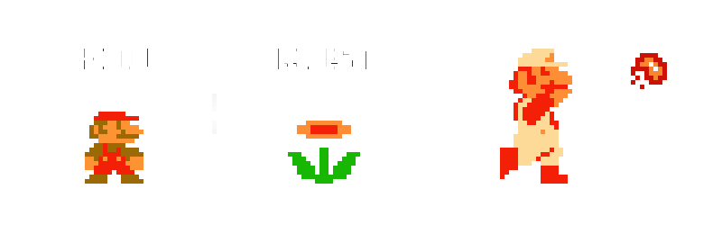

class: middle, center, overlay
# Rust and Ruby
### An introduction to becoming Fire Mario

???

- Don't bother with who you are.
- Let's get right into it.
- First:
  - We're going to gloss over a number of things and we're really only going to
    touch on Rust as a language. At the end of the workshop I'll provide a
    number of links and resources for learning about Rust and getting involved in
    the community.
- Second:
  - I'm by no means an expert. I've been using Rust for a little over a year
    or since Rust turned to 1.0. I've written a few web services in it, as well
    as an string library that we'll be using today.
---
