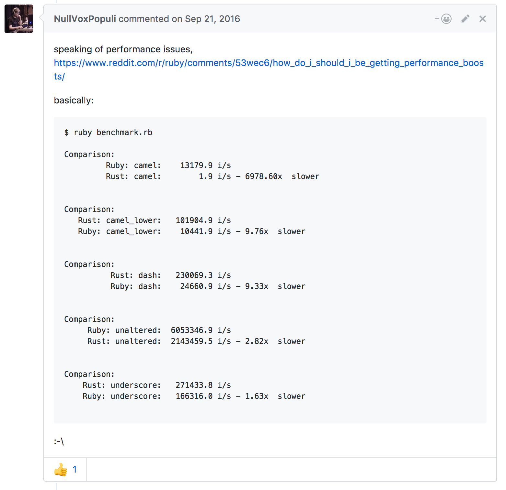
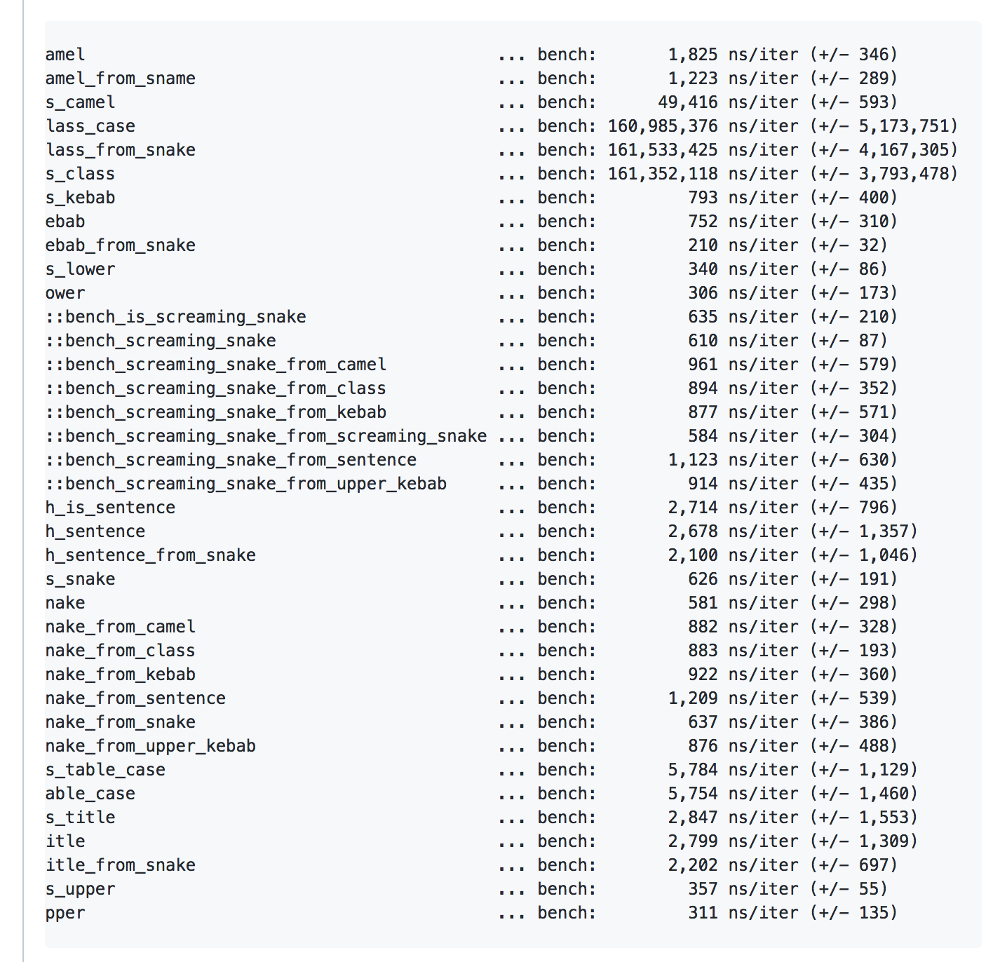

class: middle split-40
## Run some tests and benchmarks

.column[

]

.column[

]

???

- Obviously this is a trivial example as we're not really using the full power
  of Rust, and it is trivial to write Rust code that will perform worse than
  equal Ruby code. For an example see https://github.com/whatisinternet/inflector/issues/18
---
